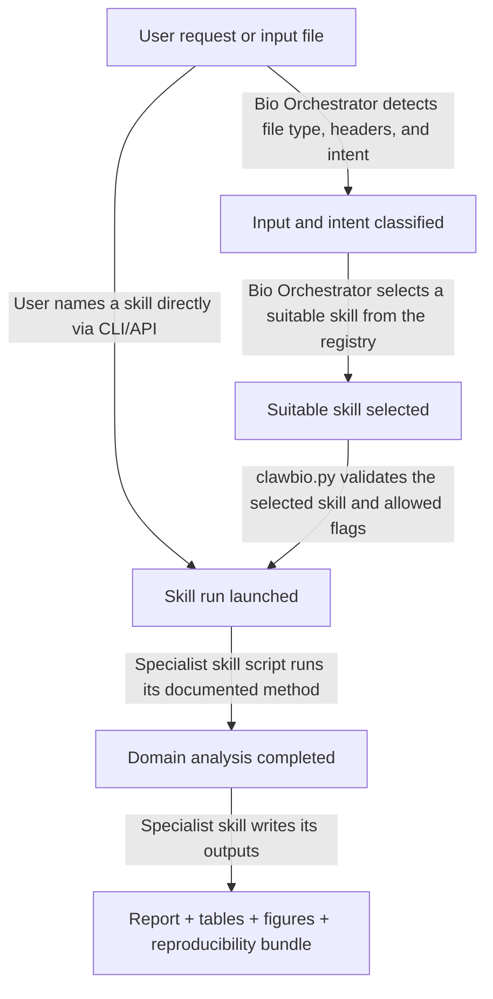

# ClawBio Brief

**Use this brief to explain ClawBio to collaborators, researchers, workshop organisers, and funders. It can also serve as a quick orientation document for AI agents working from the repository docs.**

---

## What is ClawBio?

ClawBio is a bioinformatics skill library for local, reproducible genomic analysis. It gives AI agents two things they otherwise lack in computational biology:

- **Skill wrapping**: a consistent way to interact with specialist tools and workflows through documented inputs, outputs, commands, safety constraints, and reproducibility artifacts.
- **Routing**: a way to decide which specialist skill or agent should handle a request, and what information needs to be retrieved or forwarded between steps.

Both are designed for local execution: biological data does not leave the researcher's machine unless a workflow explicitly uses an external source.

At a high level, ClawBio provides documented workflows for pharmacogenomics, GWAS lookup, PRS calculation, UK Biobank exploration, fine-mapping, and sequencing analysis, with clear inputs, outputs, and reproducibility artifacts.

## How It Relates to OpenClaw

ClawBio is built on [OpenClaw](https://github.com/OpenClaw/OpenClaw), an agent framework for persistent, tool-using AI systems. OpenClaw provides the runtime and skill model; ClawBio adds the bioinformatics layer: domain-specific skills, safety constraints, demo data, reproducibility conventions, and project documentation.

## Why It Matters

ClawBio exists to solve three recurring problems in computational biology:

1. **Privacy**: genomic and biomedical data often cannot be uploaded to external services.
2. **Reproducibility**: analyses need reports, commands, environments, and checksums that another researcher can verify.
3. **Domain grounding**: general-purpose agents are not reliable enough to improvise sensitive bioinformatics logic from scratch.

ClawBio addresses this by combining local execution, versioned skill specifications, Python implementations, demo datasets, and reproducibility bundles.

## Current Project State

As documented in `README.md`, ClawBio is currently presented as:

- **v0.5.0** of the project
- **55 skills** in the broader platform framing
- **8,000+ Galaxy tools**
- **1,401 tests + benchmark validation**
- a local-first bioinformatics stack with privacy and reproducibility as core constraints

The current public skills table in `README.md` lists **43 named skills**, comprising:

- **37 MVP skills**
- **6 planned skills**

This is a substantial expansion from the older brief, which described the project as having 7 production skills and 6 planned skills.

## How ClawBio Works

In the repository, routing (when used) is handled by the **Bio Orchestrator** skill (`skills/bio-orchestrator/`), which looks at file types, table headers, keywords, and explicit user choices. Direct CLI/API calls can bypass routing entirely by naming a skill explicitly.

The diagram separates **selection** from **execution**. Bio Orchestrator first detects what kind of input or request it has received, then selects a suitable skill from the available registry. A user can override that suggestion by naming a skill directly through the CLI or API. `clawbio.py` then validates and launches the selected skill. The specialist skill performs the scientific work and is responsible for writing the report, tables, figures, and structured `result.json`. Where supported, reproducibility artifacts include `commands.sh`, `environment.yml`, and checksums. The structured `result.json` fields are summarised in [docs/architecture.md](architecture.md#structured-next-steps).

Some skills use shared helper code for standardised metadata, disclaimers, checksums, or replay commands, but that is an implementation detail for developers rather than a separate agent role.

## Skills Snapshot

The current public skill inventory in `README.md` spans personal genomics, population genetics, benchmarking, literature, sequencing, and synthetic genomics. The visible skills table currently includes the following entries and statuses:

| Skill | Status | Description |
|-------|--------|-------------|
| Bio Orchestrator | **MVP** | Routes requests to the right skill automatically |
| PharmGx Reporter | **MVP** | 12 genes, 51 drugs, CPIC guidelines from consumer genetic data |
| Drug Photo | **MVP** | Snap a medication photo to a personalised dosage card from genotype |
| ClinPGx | **MVP** | Gene-drug lookup from ClinPGx, PharmGKB, CPIC, and FDA drug labels |
| GWAS Lookup | **MVP** | Federated variant query across 9 genomic databases |
| GWAS PRS | **MVP** | Polygenic risk scores from the PGS Catalog for 6+ traits |
| Profile Report | **MVP** | Unified personal genomic report: PGx + ancestry + PRS + nutrigenomics |
| UKB Navigator | **MVP** | Semantic search across the UK Biobank schema |
| Equity Scorer | **MVP** | HEIM diversity metrics from VCF or ancestry CSV |
| NutriGx Advisor | **MVP** | Personalised nutrigenomics across 13 dietary domains |
| Metagenomics Profiler | **MVP** | Kraken2 / RGI / HUMAnN3 taxonomy, resistome, and functional profiles |
| Ancestry PCA | **MVP** | PCA vs SGDP with confidence ellipses |
| Semantic Similarity | **MVP** | Semantic Isolation Index from 13.1M PubMed abstracts |
| Genome Comparator | **MVP** | Pairwise IBS vs George Church + ancestry estimation |
| Galaxy Bridge | **MVP** | Search, run, and chain 8,000+ Galaxy bioinformatics tools |
| RNA-seq DE | **MVP** | Bulk/pseudo-bulk differential expression with QC + PCA + contrasts |
| Methylation Clock | **MVP** | Epigenetic age from methylation arrays with PyAging clocks |
| scRNA Embedding | **MVP** | scVI/scANVI latent embedding and integrated downstream export |
| scRNA Orchestrator | **MVP** | Scanpy automation with QC, clustering, markers, annotation, and latent mode |
| Diff Visualizer | **MVP** | Visualisation for bulk RNA-seq DE and scRNA marker outputs |
| Proteomics DE | **MVP** | Differential expression for LFQ proteomics |
| Variant Annotation | **MVP** | Annotate VCF variants with Ensembl VEP REST, ClinVar, and gnomAD |
| Bioconductor Bridge | **MVP** | Bioconductor package discovery and starter workflow recommendation |
| Clinical Trial Finder | **MVP** | Find trials for a gene, variant, or condition |
| Data Extractor | **MVP** | Extract numerical data from scientific figures |
| Illumina Bridge | **MVP** | Import DRAGEN-exported Illumina result bundles |
| Protocols.io | **MVP** | Search, browse, and retrieve protocols from protocols.io |
| PubMed Summariser | **MVP** | Structured briefings of top recent PubMed papers |
| Omics Target Evidence Mapper | **MVP** | Aggregate target-level evidence across omics and translational sources |
| Target Validation Scorer | **MVP** | Evidence-grounded GO/NO-GO target scoring |
| Soul2DNA | **MVP** | Compile character profiles into synthetic diploid genomes |
| GenomeMatch | **MVP** | Score genetic compatibility across pairings |
| Recombinator | **MVP** | Produce offspring via meiotic recombination and mutation |
| Fine-Mapping | **MVP** | SuSiE/ABF credible sets with posterior inclusion probabilities |
| Clinical Variant Reporter | **MVP** | ACMG-guided clinical variant classification from VCF |
| WES Clinical Report | **MVP** | Whole-exome sequencing clinical report generation |
| LLM Biobank Bench | **MVP** | Benchmark LLMs on biobank knowledge retrieval and coverage |
| VCF Annotator | Planned | Legacy VCF annotation pipeline |
| Lit Synthesizer | Planned | PubMed/bioRxiv search with LLM summarisation and citation graphs |
| Struct Predictor | Planned | AlphaFold/Boltz local structure prediction |
| Repro Enforcer | Planned | Export analyses as Conda env + Singularity + Nextflow |
| Labstep | Planned | Labstep ELN API integration |
| Seq Wrangler | Planned | Sequence QC, alignment, and BAM processing |

## Project Milestones Since Launch

### v0.3.0 — Imperial College AI Agent Hack

- public project introduction at the UK AI Agent Hack, Imperial College London
- security audit with 32 fixes for silent degradation across 4 production skills
- major README overhaul with demo video, provenance section, and architecture framing

### v0.3.1 — Agent-Friendly Release

- introduced `llms.txt`, `AGENTS.md`, and machine-readable `skills/catalog.json`
- standardised SKILL.md files and upgraded the skill template
- added project metadata and documentation that make the repository easier to navigate and extend

### v0.4.0 — Galaxy Integration

- added Galaxy Bridge for natural-language discovery and execution across 8,000+ Galaxy bioinformatics tools
- shipped bundled Galaxy catalog data and curated tool profiles
- broadened the project's scope by connecting ClawBio skills to external bioinformatics tooling through Galaxy

### v0.5.0 — Validation & Benchmark Infrastructure

- added the **AD Ground Truth Benchmark Set**
- added a **mock API server** for deterministic offline testing
- added a **benchmark scorer** and **nightly demo sweep benchmark integration**
- introduced a **swappable fine-mapping benchmark** comparing ABF and SuSiE
- documented **74 benchmark tests** as part of the release

### Additional Strategic Milestones

- **Corpas 30x WGS reference genome** added as a project resource for demos, tutorials, and benchmarking
- **External audit** by Sergey Kornilov / Biostochastics documented in `REMEDIATION-PLAN.md`
- **UK AI Agent Hackathon 2026 Winner**
- **Bioinformatics Application Note submitted**
- as of **29 April 2026**, the repository showed **767 GitHub stars** and **154 forks**

## Why ClawBio Is Different

ClawBio differs from ad hoc LLM-assisted bioinformatics workflows in a few practical ways:

- **Local execution**: data stays on the researcher's machine unless a workflow explicitly uses an external source.
- **Documented methods**: domain logic is recorded in `SKILL.md`, together with implementation details and operating constraints.
- **Reproducible outputs**: analyses produce reusable artifacts, not just chat responses.
- **Modular structure**: skills can be developed, tested, and improved independently.
- **Readable project metadata**: the repository includes documentation and machine-readable indexes that help both contributors and software agents navigate the project.

## Who This Is For

- **Researchers** who want local, inspectable analyses instead of opaque cloud workflows
- **Tool builders** who want to package methods as reusable skills
- **Collaborators and funders** who need a concise picture of project maturity and trajectory
- **AI agents and automation tools** that need explicit project structure, capabilities, and execution guidance

## Historical Notes

The original February 2026 meetup context that launched this brief has been archived separately in [docs/talks/london-bioinformatics-meetup-2026.md](talks/london-bioinformatics-meetup-2026.md). That material remains useful as project history, but it is no longer the framing for the main ClawBio brief.

## Links

- **Main README**: [README.md](../README.md)
- **Changelog**: [CHANGELOG.md](../CHANGELOG.md)
- **Remediation Plan**: [REMEDIATION-PLAN.md](../REMEDIATION-PLAN.md)
- **Slides**: [clawbio.github.io/ClawBio/slides/](https://clawbio.github.io/ClawBio/slides/)
- **Reference Genome**: [docs/reference-genome.md](reference-genome.md)
- **Tutorial**: [Install your own RoboTerri](tutorial-roboterri-install.md)
- **OpenClaw**: [github.com/openclaw/openclaw](https://github.com/openclaw/openclaw)
- **ClawHub**: [clawhub.ai](https://clawhub.ai)

## License

MIT. See [LICENSE](../LICENSE).
